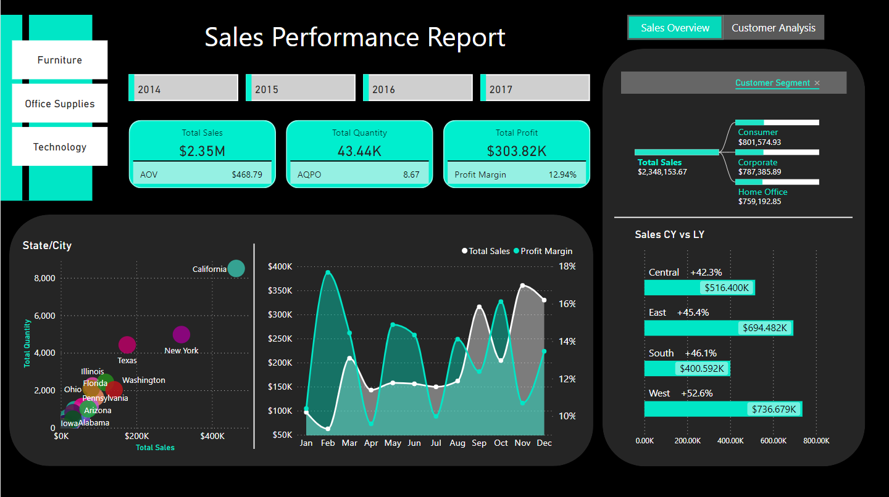

# Sales Dashboard

This Power BI Sales Dashboard provides a comprehensive overview of sales performance. It offers insights into sales trends, product performance, customer behavior, and more, enabling better decision-making and strategic planning.

## Features

- **Sales Overview:** Visualizes total sales, sales by region, and sales trends over time.
- **Product Performance:** Analyzes sales performance by product category, top-selling products, and revenue contribution.
- **Customer Analysis:** Examines customer demographics, Top 10 customers.
- **Profitability Metrics:** Tracks gross net profit, profit margins, and profitability trends over the period.
- **Interactive Filters:** Allows users to filter data by date, region, product category, customer segment, etc.

## Key Performance Indicators (KPIs)

- **Total Sales:** The total revenue generated from sales.
- **Total Profit:** The total profit generated from sales after deducting all expenses.
- **Profit Margin:** The percentage of revenue that remains as profit after deducting all expenses.
- **Average Order Value (AOV):** The average value of each sales transaction.
- **Average Quantity per Order:** The average quantity of products sold per order.
- **Total Customers:** The total number of unique customers.
- **Total Orders:** The total number of orders placed.
- **Customer Retention:** The percentage of customers retained over a specific period.

## Getting Started

To use this Sales Dashboard:

1. **Prerequisites:** Ensure you have Power BI Desktop installed on your computer. If not, download and install it from the [Microsoft website](https://powerbi.microsoft.com/desktop/).
   
2. **Download the Dashboard:** Download the `.pbix` file from the repository.

3. **Open in Power BI Desktop:** Open Power BI Desktop and load the downloaded `.pbix` file.

4. **Explore the Dashboard:** Interact with the visualizations to explore sales data, analyze trends, and gain insights.
